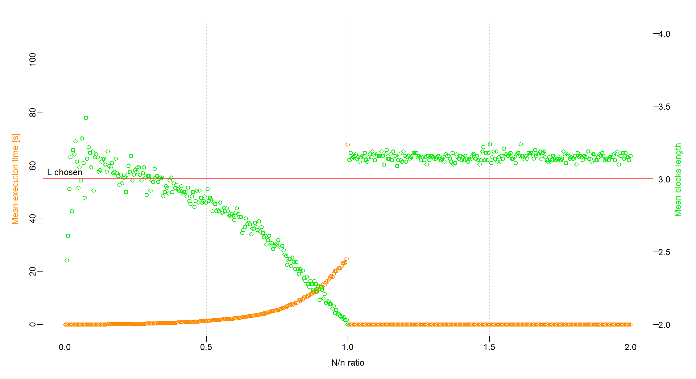

# Block bootstrap for R 


[](https://codecov.io/gh/lamferzon/block-bootstrap-for-R)


## Author ##
**Lorenzo LEONI**, postgraduate in Computer Engineering at University of Bergamo.

## Description ##
If data are correlated, then it is not possible to use a simple resampling due to its inability to replicate the correlation in the data. The block bootstrap tries to overcome this issue by resampling inside blocks of data.

## Installation ##
Install the bboot package via GitHub:
``` r
# install.packages("devtools")
devtools::install_github("lamferzon/block-bootstrap-for-R")
library(bboot)
``` 
## Performance analysis ##
The configuration chosen for evaluating the performance of the function ```blockboot()``` is:
``` r
n <- length(air$Temperature) # 2192
N <- seq(2, 4382, 10)
K <- 5
L <- 3
l_gen <- "poisson"
```
The following graphs describe the trend of the mean computational time and of the mean blocks length as a function of the $N/n$ ratio:


- [x] Simulations **without** blocks rejection for $N$ greater than $n$. As regards the mean computational time, it can be seen that it increases exponentially as $N$ increases up to $n$, after which it settles on a values close to $0$. Instead, as concerning the mean blocks length it can be note as the algorithm performs well up to $50 \\%$ of $n$. In fact, the mean blocks length is near to $L$ because the number of rejected blocks is not yet significant (the number of available indexes at each iteration is high).


- [x] Simulations **with** blocks rejection for $N$ greater than $n$. Differently from the previous case, it is possible to see how the mean computational time increases as $N$ increases for $N$ greater than $n$ if blocks can be rejected (another block already exists having the same first index as the selected one, so it is discarded). This behaviour is due the reduction of available indexes as the number of chosen data approaches to $N$.
